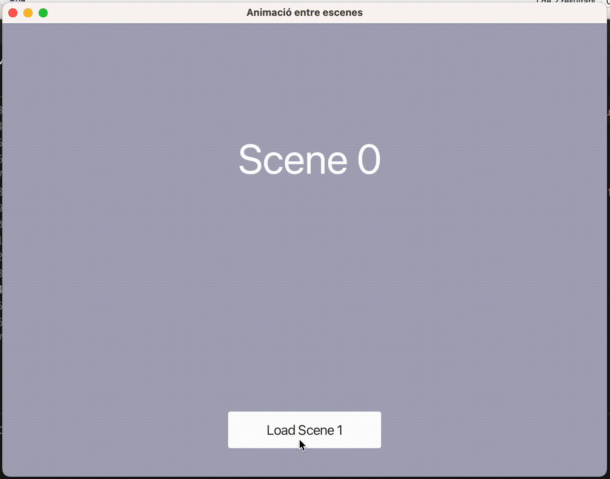

# Exemple de JavaFX amb arxius FXML #

En aquest projecte hi ha exemples de com fer canvis d'escena animats entre vistes d'arxius .fxml

### A tenir en compte ###

Els controladors dels arxius FXML s'han de carregar al codi, no es pot fer servir l'atribut "fx:controller"

```
FXMLLoader loader = new FXMLLoader(getClass().getResource("./assets/scene0.fxml"));
loader.setController(new Scene0Controller());
Pane root = loader.load();
```

### Compilació i funcionament ###

A Linux i OSX:

```
./run.sh
```

A Windows Powershell:

```
.\run.bat
```

### Llicència ###

Tenir en compte les llicències JavaFX que hi ha en cada una de les respectives carpetes

[JavaFX](https://openjdk.org/projects/openjfx/)

### Captures ###



